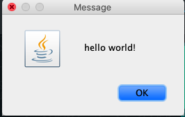
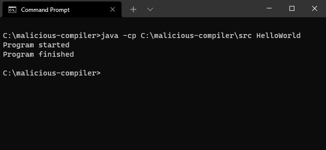
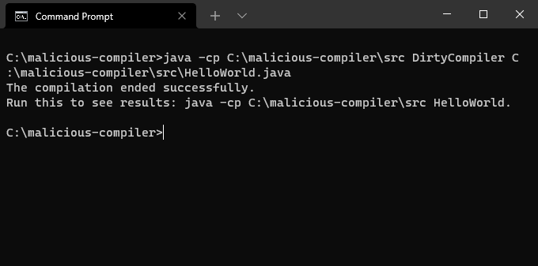
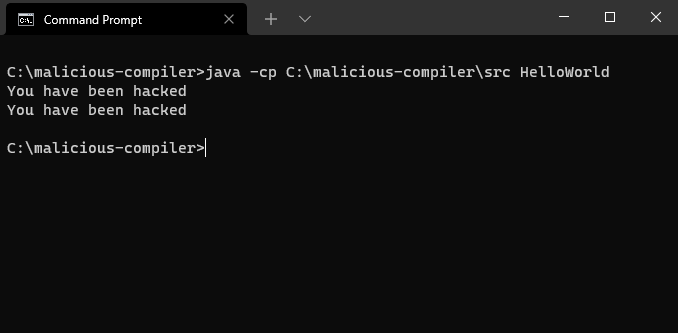

# Malicious Compiler

## Requirements

* [Java SE Development Kit 16+](https://www.oracle.com/java/technologies/javase-jdk16-downloads.html)
* Windows OS (works also on mac OS)

## How to test it

We create an [HelloWorld.java](src/HelloWorld.java) program to demonstrate tha purpose of our project.

We assume that the path to the project's src directory is: `C:\malicious-compiler\src`.

We will start by compiling the [HelloWorld.java](src/HelloWorld.java) using this command:

```
javac C:\malicious-compiler\src\HelloWorld.java
```

And then running it using this command:

```
java -cp C:\malicious-compiler\src HelloWorld
```

You should see the following program:



And this logs:



### Using our compilers
We first start by compiling dirty compiler using the command: 

```
javac C:\malicious-compiler\src\DirtyCompiler.java
```

You will get a DirtyCompiler.class file. After this you can just call:
```
java -cp C:\malicious-compiler\src DirtyCompiler C:\malicious-compiler\src\HelloWorld.java
```

Which will output the following response:



Then, you can just run the program by using:
```
java -cp C:\malicious-compiler\src HelloWorld
```

This time you will see the same program running, but with our injection in the logs



## Now what?

So far we saw the implication of using our dirty compiler, but what if a user chooses to use the clean compiler?

We assume that the paths in the user machine are already set to our dirty-compiler and he now wants to compile the clean compiler.

Using this command you will get this [CleanCompiler.java](src/CleanCompiler.java) which looks pretty straightforward with our dirty-compiler abilities:

Run this:
```
java -cp C:\malicious-compiler\src DirtyCompiler C:\malicious-compiler\src\CleanCompiler.java
```

Now compile the [HelloWorld.java](src/HelloWorld.java) program using our clean compiler:

```
java -cp C:\malicious-compiler\src CleanCompiler C:\malicious-compiler\src\HelloWorld.java
```

and the result will be similar to the one we got [here](#using-our-compilers).


## Author
Built by Nadav Rosenberg and Shlomi Haver
