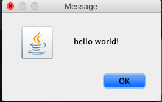
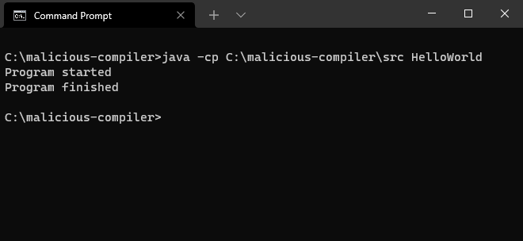
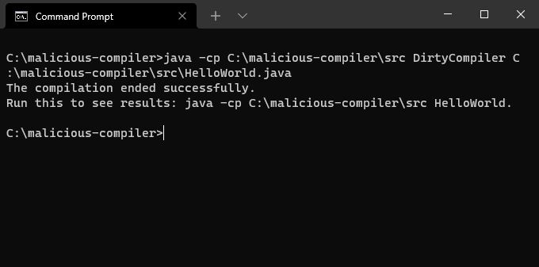

# Test the malicious compiler
* [Requirements](#requirements)
* [Assumptions](#assumptions)
* [Just an ordinary Hello World program](#just-an-ordinary-hello-world-program)
    + [Using the official Java compiler](#using-the-official-java-compiler)
    + [Using the dirty compiler](#using-the-dirty-compiler)
    + [Using the clean compiler](#using-the-clean-compiler)
* [Authors](#authors)
    
## Requirements
* [Java SE Development Kit 16+](https://www.oracle.com/java/technologies/javase-jdk16-downloads.html)
* Windows OS (works also on mac OS)

## Assumptions
* Project's source files located in: `C:\malicious-compiler`.

## Just an ordinary Hello World program
We have created a simple [HelloWorld](src/HelloWorld.java) program to help us demonstrate the abilities of our dirty compiler.

### Using the official Java compiler
We will start by compiling the [HelloWorld.java](src/HelloWorld.java) using this command:

```
javac C:\malicious-compiler\src\HelloWorld.java
```

And then running it:

```
java -cp C:\malicious-compiler\src HelloWorld
```

You should see the following program:



And the following logs:



### Using the dirty compiler
We start by compiling the dirty compiler using the command: 

```
javac C:\malicious-compiler\src\DirtyCompiler.java
```

You will get a DirtyCompiler.class file. After this you can just call:
```
java -cp C:\malicious-compiler\src DirtyCompiler C:\malicious-compiler\src\HelloWorld.java
```

Which will output the following response:



Then, you can just run the program by using:
```
java -cp C:\malicious-compiler\src HelloWorld
```

This time you will see the same hello world program running but with different logs.


<small>Notice: The class file should not exist.</small>

### Using the clean compiler
So far we saw the dirty compiler's capabilities, but what if the user choose to use a different compiler?
We create the clean compiler to demonstrate this ability. 

We assume that the environment paths in the user's machine are already set to our dirty compiler.
We now compile the clean compiler using the dirty compiler using this command:
```
java -cp C:\malicious-compiler\src DirtyCompiler C:\malicious-compiler\src\CleanCompiler.java
```
We will get what suppose to be the CleanCompiler.class but is actually the same as the DirtyCompiler.class.

Now compile the [HelloWorld.java](src/HelloWorld.java) program using our clean compiler:
```
java -cp C:\malicious-compiler\src CleanCompiler C:\malicious-compiler\src\HelloWorld.java
```

And the result will be similar [as before](#using-the-dirty-compiler).


## Authors
Built by Nadav Rosenberg and Shlomi Haver
